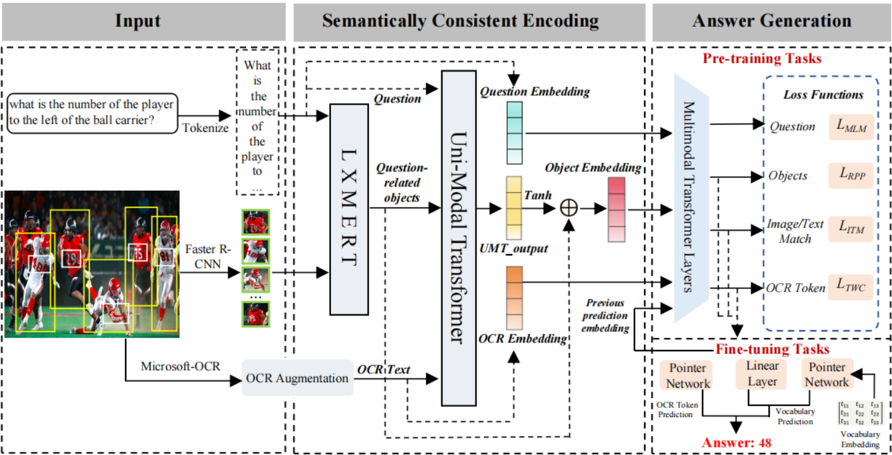

# **Cascade Transformer for Hierarchical Semantic Reasoning in Text-based VQA**



## Repository Setup

### Create a fresh conda environment, and install all dependencies.

```
conda create -n CT-HSR_env python=3.8
conda activate CT-HSR_env
git clone https://github.com/FTFWO/CT-HSR
cd CT-HSR
pip install -r requirements.txt
```
### Data

```
data
├── detectron
├── dict
├── feat_resx
├── imdb
├── m4c_vocabs
├── ocr_feat_resx
├── original_dl
├── 1600-400-20

```
We recommend using the following AzCopy command to download. AzCopy executable tools can be downloaded [here](https://learn.microsoft.com/en-us/azure/storage/common/storage-use-azcopy-v10?tabs=dnf#download-azcopy). 
[TextVQA/Caps/STVQA Data (~62G).](https://tapvqacaption.blob.core.windows.net/data/data)
```
path/to/azcopy copy <folder-link> <target-address> --resursive

# for example, downloading TextVQA/Caps/STVQA Data
path/to/azcopy copy https://tapvqacaption.blob.core.windows.net/data/data <local_path>/CT-HSR/data --recursive
```

### Training and Evaluation
